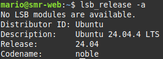
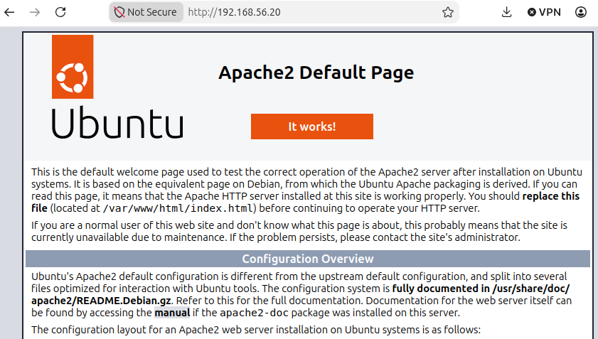
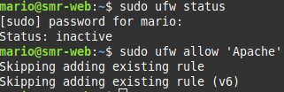
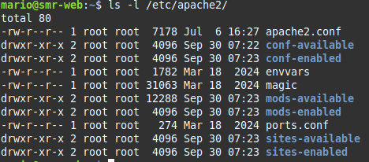
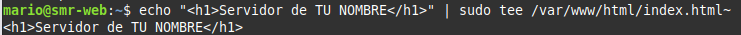
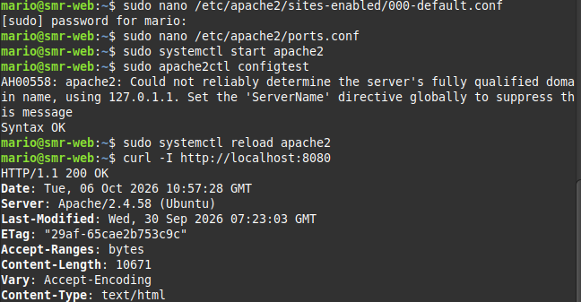

# Práctica: Instalación, configuración y securización de Apache en Ubuntu 24.04
## 4. Desarrollo de la práctica
### Apartado 1. Preparación del sistema
Primero actualizaremos los repositorios de ubuntu con el comando ```sudo apt update```<br>
<br>
Y comprobaremos la version del sistema con ```lsb_release -a```<br>
<br>
### Apartado 2. Instalación de Apache
Ahora instalaremos Apache con el comando ```sudo apt install apache2 -y```<br>
<br>
> ¿Qué paquetes adicionales se han instalado como dependencias? (pista: revisa la salida de apt).
### Apartado 3. Comprobación del funcionamiento
Ahora vamos a comprobar el funcionamiento del servidos, estoy hay que hacerlo en 4 partes que son las siguientes:
  1. Con el comando ```sudo systemctl status apache2``` comporbaremos el estado del servicio
  2. Con el comando ```sudo ss -tulpn | grep apache2``` comprobaremos que puertos estan escuchando
  3. Para hacer pruebas las podemos hacer en la terminal o desde el navegador, en la terminal tendriamos que poner el siguiente comando ```curl -I http://localhost``` o en el navegador escribir lo siguiete *http://IP_DE_TU_SERVIDOR.*
     <br>
  4. Ahora comprobaremos si el Firewall esta activo y le diremos que deje a 'Apache' hacer lo que tenga que hacer con los siguientes comandos ```sudo ufw status``` y ```sudo ufw allow 'Apache'```<br>
        <br>
> ¿Qué diferencia hay entre los perfiles Apache, Apache Full y Apache Secure?<br>
### Apartado 4. Comandos principales de administración
En este apartado vamos a probar varios comandos de apache
|Comando                              |Resultado                                      |
|-------------------------------------|-----------------------------------------------|
|```sudo systemctl start apache2```   |Inicia el servicio                             |
|```sudo systemctl stop apache2```    |Detiene el servicio                            |
|```sudo systemctl restart apache2``` |Reinicia (corta conexiones)                    |
|```sudo systemctl reload apache2```  |Recarga la configuración sin cortar conexiones |
|```sudo systemctl enable apache2```  |Arranque automático al iniciar el sistema      |
|```sudo systemctl enable apache2```  |Desactiva el arranque automático               |
|```apache2ctl configtest```          |Comprueba la sintaxis de la configuración      |
|```apache2ctl -S```                  |Muestra los sitios (virtual hosts) cargados    |
|```apache2ctl -M```                  |Lista los módulos cargados                     |
|```a2enmod / a2dismod```             |Activa / desactiva módulos                     |
|```a2ensite / a2dissite```           |Activa / desactiva sitios                      |
|```a2enconf / a2disconf```           |Activa / desactiva fragmentos de configuración |
> ¿Cuándo conviene usar reload en lugar de restart?
### Apartado 5. Ficheros y directorios importantes
Para explorar la estructura y configuracion del servidor utilizaremos el comando ```ls -l /etc/apache2/```
<br>
|Ruta                                            |Descripción                                                    |
|------------------------------------------------|---------------------------------------------------------------|
|*/etc/apache2/apache2.conf*                     |Fichero de configuración principal                             |
|*/etc/apache2/ports.conf*                       |Puertos en los que escucha Apache                              |
|*/etc/apache2/sites-available/*                 |Sitios disponibles (definidos, no necesariamente activos)      |
|*/etc/apache2/sites-enabled/*                   |Sitios activos (enlaces simbólicos a sites-available)          |
|*/etc/apache2/mods-available/ y mods-enabled/*  |Módulos disponibles y activos                                  |
|*/etc/apache2/conf-available/ y conf-enabled/*  |Fragmentos de configuración disponibles y activos              |
|*/etc/apache2/envvars*                          |Variables de entorno (usuario y grupo de ejecución, etc.)      |
|*/var/www/html/*                                |Directorio raíz por defecto (DocumentRoot)                     |
|*/var/log/apache2/access.log*                   |Registro de accesos                                            |
|*/var/log/apache2/error.log*                    |Registro de errores                                            |

> ¿Por qué Apache usa enlaces simbólicos entre los directorios *-available* y *-enabled*? 
### Apartado 6. Modificaciones típicas del servicio
Ahora como vamos a hacer modificaciones al servidor, vamos a hacer una copia de seguridad para que en el caso que algo falle no perdamos el servidor por completo, esto lo haremos con el comando ```sudo cp /etc/apache2/apache2.conf /etc/apache2/apache2.conf.bak```
Las modificaciones que vamos a hacer son las siguientes: <br>
  **1. Cambiar la página de inicio**<br>
  Para esto utilizaremos el siguiente comando ```echo "<h1>Servidor de TU NOMBRE</h1>" | sudo tee /var/www/html/index.html```
  <br>
  **2. Cambiar el puerto de escucha**<br>
  Para esto vamos a necesitar utilizar ```sudo nano /etc/apache2/ports.conf```, aqui cambiaremos Listen 80 por Listen 8080, y ```sudo nano /etc/apache2/sites-available/000-default.conf``` donde cambiaremos *<VirtualHost *:80>** por *<VirtualHost *:8080>**
  <br>
Para despues utilizar los siguientes comandos ```sudo apache2ctl configtest```, ```sudo systemctl reload apache2``` y ```curl -I http://localhost:8080``` <br>
  <br>
  **3. Definir el nombre del servidor**
  Esto lo vamos a hacer para eliminar el aviso que salia de *"Could not neriably determine the server's fully qualified name"*. Esto lo haremos con los siguientes comandos ```echo "ServerName localhost" | sudo tee /etc/apache2/conf-available/servername.conf```, ```sudo a2enconf servername``` y ```sudo systemctl reload apache2```
